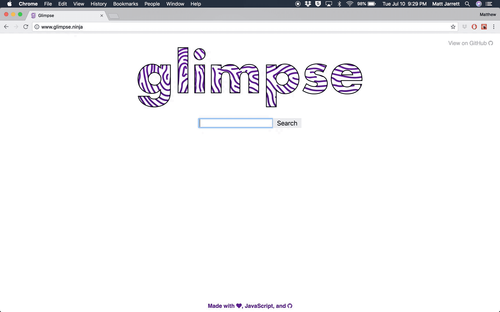
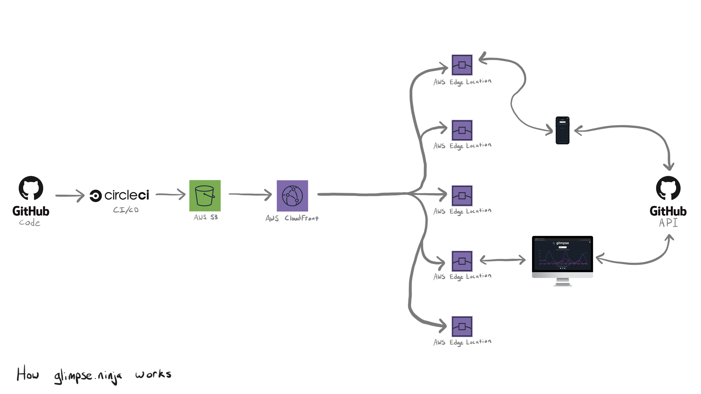

  
  
  

## What is it?

A simple way, on any device, to quickly see the frequency of [Open Source Software (OSS)](https://en.wikipedia.org/wiki/Open-source_software) contributions by any GitHub user.

## How does it work?

## Want to Contribute?
Rad, thanks! Check out the [contributing guide](./CONTRIBUTING.md).

## CHANGELOG
[Glimpse changelog](./CHANGELOG.md)

Made with :heart:, JavaScript, and GitHub.
